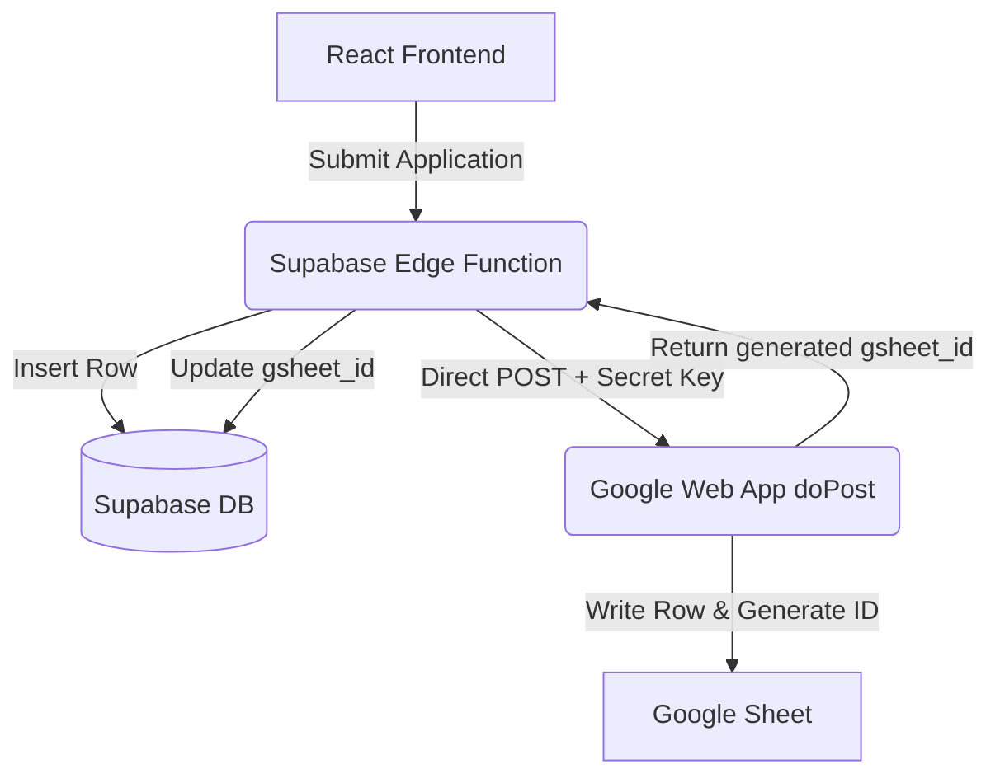

# Comprehensive Technical Report: Google Sheets Direct Integration & Sync

This report details all modifications made across the SmaranAI codebase (Frontend, Supabase Edge Functions, and Google Sheets Apps Script) to enable the secure direct sync flow.

---

## 🛠️ 1. Architecture Overview

To prevent public spam and bypass Google Form login/cookie restrictions, we moved the Google Sheet submission from the browser frontend to the secure Deno Edge Function backend.



---

## 📂 2. Detailed Codebase Modifications

### A. Backend Edge Function (`supabase/functions/w_edge/index.ts`)
* **Modification Location:** Inside `case "create_internship_application":`
* **Changes Made:**
  1. Added a check for the environment variable `GOOGLE_GSHEET_WEBAPP_URL`.
  2. If the URL is set, the function makes a secure POST request to the Apps Script Web App.
  3. Sends `action: "add_application"`, a secure secret key, and the sanitized applicant data.
  4. Waits for the Google Web App response. Upon receiving a successful response containing the generated `gsheet_id`, it updates the matching record in the `w_internship_applications` table.
  5. If the URL is not set, it safely falls back to the legacy client-side Google Form submission.

### B. React Frontend (`User/src/Pages/ApplyInternship.js`)
* **Modification Location:** Inside `postToGoogleForm` mapping.
* **Changes Made:**
  1. Updated the field mapping object to robustly resolve Google Form field keys from environment variables (e.g. `process.env.REACT_APP_GOOGLE_FORM_FIELD_EMAIL`) with fallback values.
  2. Aligned input data structures so that the applicant's email is passed cleanly and consistently.

### C. Google Sheets Apps Script (`Code.gs`)
* **Modification Location:** Appended at the bottom of the editor.
* **Changes Made:**
  1. **Kept the legacy trigger code untouched** so manual form submissions are not broken.
  2. Added **`doPost(e)`** to handle POST requests from the Edge Function backend.
  3. Added **`getFieldKeyFromHeader(header)`** to dynamically map sheet headers to database keys.
  4. Added **`formatRow(headers, rowVals)`** to build the multi-line candidate summary.

---

## 📦 3. Required Google Apps Script Code

This block of code must be pasted at the very bottom of the Google Sheet Apps Script editor:

```javascript
// =======================================================
// PASTE THIS AT THE VERY BOTTOM OF YOUR SCRIPT
// =======================================================

function doPost(e) {
  try {
    var requestData = JSON.parse(e.postData.contents);
    var secret = requestData.secret;
    
    // Secure webhook key check
    if (secret !== "smaranai-gsheet-webhook-secret-2026") {
      return ContentService.createTextOutput(JSON.stringify({ error: "Unauthorized webhook key" }))
                           .setMimeType(ContentService.MimeType.JSON);
    }
    
    var action = requestData.action;
    if (action === "add_application") {
      var application = requestData.application;
      
      var sheet = SpreadsheetApp.getActiveSpreadsheet().getSheetByName("Form responses 1");
      if (!sheet) {
        sheet = SpreadsheetApp.getActiveSpreadsheet().getSheets()[0];
      }

      var headers = sheet.getRange(1, 1, 1, sheet.getLastColumn()).getValues()[0];
      
      var row = [];
      for (var i = 0; i < headers.length; i++) {
        var header = headers[i];
        if (header === "Timestamp") {
          row.push(new Date());
        } else if (header === "ApplicationID") {
          row.push(""); 
        } else {
          var fieldKey = getFieldKeyFromHeader(header);
          row.push(application[fieldKey] !== undefined ? application[fieldKey] : "");
        }
      }
      
      sheet.appendRow(row);
      var newRowNum = sheet.getLastRow();
      
      var idColIdx = headers.indexOf("ApplicationID") + 1;
      var newID = "";
      if (idColIdx > 0) {
        var maxNum = 0;
        if (newRowNum > 2) {
          var data = sheet.getRange(2, idColIdx, newRowNum - 2).getValues();
          for (var j = 0; j < data.length; j++) {
            if (data[j][0]) {
              var num = parseInt(data[j][0].toString().replace("A", ""), 10);
              if (!isNaN(num) && num > maxNum) maxNum = num;
            }
          }
        }
        newID = "A" + ("0000" + (maxNum + 1)).slice(-4);
        sheet.getRange(newRowNum, idColIdx).setValue(newID);
      }
      
      var summaryColIndex = headers.indexOf('Summary-Auto') + 1;
      if (summaryColIndex > 0) {
        var dataEndCol = Math.min(38, sheet.getLastColumn()); 
        var rowVals = sheet.getRange(newRowNum, 1, 1, dataEndCol).getValues()[0];
        sheet.getRange(newRowNum, summaryColIndex).setValue(formatRow(headers, rowVals));
      }
      
      return ContentService.createTextOutput(JSON.stringify({ success: true, gsheet_id: newID }))
                           .setMimeType(ContentService.MimeType.JSON);
    }
    
    return ContentService.createTextOutput(JSON.stringify({ error: "Unknown action" }))
                         .setMimeType(ContentService.MimeType.JSON);
  } catch (err) {
    return ContentService.createTextOutput(JSON.stringify({ error: err.toString() }))
                         .setMimeType(ContentService.MimeType.JSON);
  }
}

function getFieldKeyFromHeader(header) {
  var normalized = String(header).toLowerCase().trim().replace(/[^a-z0-9]/g, "");
  
  if (normalized.includes("fullname")) return "full_name";
  if (normalized === "email" || normalized.includes("emailaddress")) return "email";
  if (normalized.includes("phonenumber") || normalized === "phone") return "phone_number";
  if (normalized.includes("linkedin")) return "linkedin_profile";
  if (normalized.includes("nativestate") || normalized === "state" || normalized.includes("nativeof")) return "native_state";
  if (normalized.includes("currentlocation") || normalized.includes("countrystatecity")) return "country_state_city";
  if (normalized.includes("programtype")) return "program_type";
  if (normalized.includes("majorspecialization") || normalized === "branch") return "major_specialization";
  if (normalized.includes("graduationyear")) return "graduation_year";
  if (normalized.includes("university") || normalized.includes("institution")) return "university";
  if (normalized.includes("skills")) return "skills_description";
  if (normalized.includes("priorityrole") || normalized === "role") return "top_priority_role";
  if (normalized.includes("raterole") || normalized.includes("rating")) return "role_rating";
  if (normalized.includes("availability")) return "availability";
  if (normalized.includes("daystimings")) return "days_timings";
  if (normalized.includes("dateyoucanjoin") || normalized.includes("jointodate") || normalized.includes("availabletojoin")) return "available_to_join";
  if (normalized.includes("plantostay") || normalized.includes("durationstay") || normalized.includes("durationofstay")) return "duration_stay";
  if (normalized.includes("experience") || normalized.includes("exp")) return "experience_months";
  if (normalized.includes("stipend")) return "highest_stipend";
  if (normalized.includes("portfolio") || normalized.includes("website")) return "portfolio_url";
  if (normalized.includes("remarks") || normalized.includes("comments")) return "remarks";
  if (normalized.includes("howheard")) return "how_heard_about_us";
  if (normalized.includes("applyconfirmation") || normalized.includes("confirm")) return "apply_confirmation";
  if (normalized.includes("cv") || normalized.includes("resume")) return "cv_url";
  
  return String(header).toLowerCase().trim().replace(/[\s\-\_]+/g, "_");
}

function formatRow(headers, rowVals) {
  var summary = [];
  for (var i = 0; i < Math.min(headers.length, rowVals.length); i++) {
    if (headers[i] && rowVals[i] !== undefined && rowVals[i] !== null && rowVals[i] !== "") {
      summary.push(headers[i] + ": " + rowVals[i]);
    }
  }
  return summary.join("\n");
}
```

---

## 📋 4. Action Checklist for Deployment

1. **Paste script functions**: Paste the code block above into Extensions $\rightarrow$ Apps Script.
2. **Deploy as Web App**:
   * Execute as: `Me (your-account)`
   * Who has access: `Anyone`
   * Copy the Web App URL.
3. **Configure Environment Variable**: Set the `GOOGLE_GSHEET_WEBAPP_URL` environment variable inside the Supabase vault secrets.

---

## 🔍 5. Function Breakdowns & Descriptions

Here is a detailed explanation of what each function in the Apps Script project is responsible for:

### Webhook API Functions (New)
* **`doPost(e)`**  
  An HTTP POST handler that acts as a secure API endpoint. When the database edge function submits a payload containing a new application:
  1. Validates the `secret` key.
  2. Maps standard database keys to sheet columns dynamically.
  3. Appends the new application record as a row in the sheet.
  4. Generates a unique sequential `ApplicationID` (e.g. `A0042`).
  5. Assembles all columns to write a summary inside the `Summary-Auto` cell.
  6. Returns the generated ID back to the backend database instantly in the JSON response body.
  
* **`getFieldKeyFromHeader(header)`**  
  A mapping helper. It normalizes headers (e.g. `"Full Name"`, `"Email Address"`) by removing spaces and symbols to match the JSON keys sent by the backend.

### Legacy Form Trigger Functions (Existing)
* **`onFormSubmit(e)`**  
  Triggered automatically whenever a user manually submits the public Google Form. Calls `handleApplicationId`, `handleSummaryAuto`, and triggers the webhook back to Supabase.
  
* **`handleApplicationId(e)`**  
  Iterates through all existing entries in the Sheet to find the highest sequential number, then generates the next `ApplicationID` (e.g. `A0001`) and saves it to the row.
  
* **`handleSummaryAuto(e)`**  
  Retrieves all columns for the submitted row and compiles them into a single string formatted to display inside the `Summary-Auto` cell.
  
* **`syncGsheetIdToDb(e)`**  
  Fires a POST request back to Supabase Edge Function to update the synced `gsheet_id` matching the applicant's email address.
  
* **`formatRow(headers, rowVals)`**  
  Concatenates headers and their corresponding values into a multi-line string used for the automated summaries.
